* [前言](#前言)
* [計算機技術的影響 — 進入信息時代](#計算機技術的影響進入信息時代)
* [計算機的本質](#計算機的本質)
* [關於計算的歷史](#關於計算的歷史)
* [計算機的發展](#計算機的發展)
* [IBM的創始人 — Herman Hollerith](#IBM的創始人HermanHollerith)
* [計算設備的發展歷程](#計算設備的發展歷程)
* [參考資料](#參考資料)

---

# 前言

计算机是当今世界的命脉，如果突然关掉所有计算机，那么世界将会直接乱套。我们生活中很多产品也都是依靠计算机生产出来的。所以说， **计算机改变了我们生活几乎所有方面，计算机对我们社会的重要性不言而喻** 。

类比与 **工业革命** 使人民的生产水平大大提高，计算机的出现与发展通过使世界进步飞速，也许未来人民会将计算机的出现与发展，称作 **信息革命** 。

# 計算機技術的影響&nbsp;—&nbsp;進入信息時代

- 出现自动化农业设备与医疗设备
- 全球通信和全球教育机会变得普遍
- 出现意想不到的虚拟现实、无人驾驶、人工智能等新领域

# 計算機的本質

极其简单的组件，通过一层层的抽象，来做出复杂的操作。计算机中的很多东西，底层其实都很简单，让人难以理解的，是一层层精妙的抽象。像一个越来越小的俄罗斯套娃。

# 關於計算的歷史

- 公元前 2500 年，算盘出现，为十进制，功能类似一个计数器。
- 公元前 2500 年-公元 1500 年：星盘、计算尺等依靠机械运动的计算设备出现。
- 公元 1613 年：computer 的概念出现，当时指的是专门做计算的职业。
- 1694 年：步进计算器出现，是世界上第一台能自动完成加减乘除的计算器。
- 1694-1900 年：计算表兴起，类似于字典，可用于查找各种庞大的计算值。
- 1823 年：差分机的设想出现，可以做函数计算，但计划最后失败。
- 19 世纪中期：分析机的设想出现，设想存在可计算一切的通用计算机。
- 1890 年：打孔卡片制表机。原理：在纸上打孔 → 孔穿过针 → 针泡入汞 → 电路连通 → 齿轮使计数+1。

# 計算機的發展

因为社会的规模不断扩张，普通的心算已经无法满足需求，这时出现了算盘，集存储和计算一体。此外还有星盘，用于船只计算海上经纬度；计算尺，用于计算乘法和除法；以及各种时钟用来计时。这些设备让原先费力的计算，变得简单与精确。

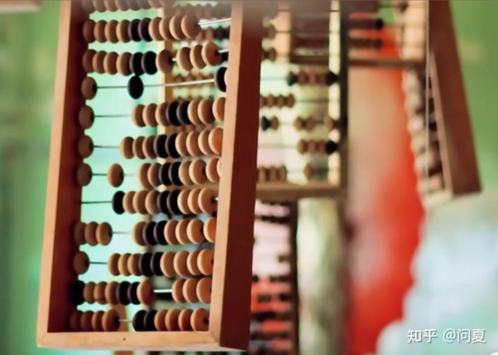

有意思的是，在以前Computer并不是指计算机，而是指负责计算的人，这个职业在1600年至1800年存在。后面，计算机才逐渐指机器，其中以步进计算器最为有名。步进计算器是第一台能自动进行加减乘除的机器，它逢十自动进一，主要利用齿轮间的转到进行进位。

后来，由于生活和战争的需要，开发一个先进的计算机器越来越重要。这时，一个很跨时代的概念出现了——分析机，这个分析机不仅能完成加减乘除运算，还能对数据和事件进行一系列操作，不过由于观念太超前，当时无法做出来。但是，这种通用的自动的计算机器的概念，给时代带来了新的思想。

# IBM的創始人&nbsp;—&nbsp;Herman&nbsp;Hollerith

在没有计算机的时代，人口普查往往需要大量的人力物力，若完全完成一次人口普查，可能需要长达10几年之久。这时美国政府找来了Herman Hollerith，他为政府开发了一个机器打孔机，通过打孔来记录数据，能够更快地记录人口情况。这一发明大大提升了人口普查的效率。

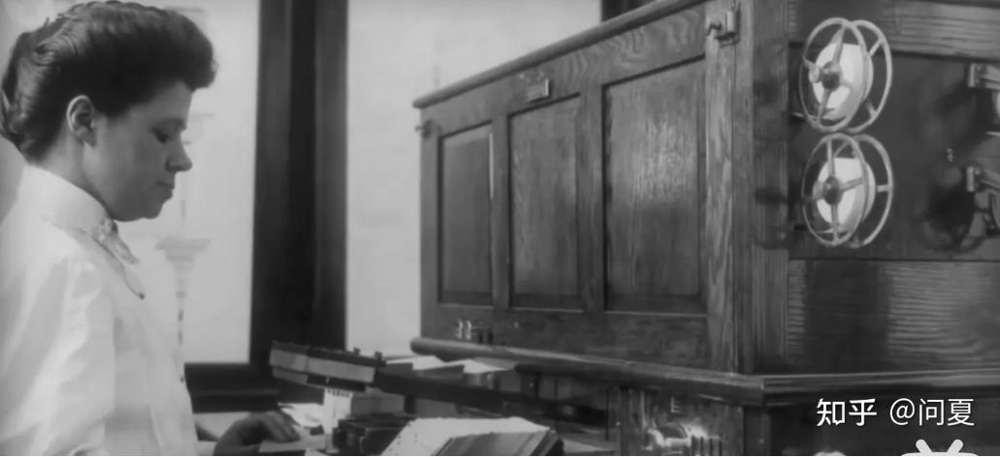

他的机器是 "电子机械式的”，它使用传统机械来计数，结构类似莱布尼茨的"步进计算器"，但将它们与电力驱动的部件结合在一起，，Hollerith 的机器用打孔卡，这是一种纸卡，上面有网格，用打孔来表示数据，举个例子，有一连串孔代表婚姻状况，如果你结婚了，就在 "结婚" 的位置打孔，当卡插入 Hollerith 的机器时，小金属针会到卡片上，如果有个地方打孔了，针就会穿过纸上的孔，进入一个装有水银的小瓶，联通电路，电路会驱动电机，然后给 "已婚" 的齿轮 + 1。

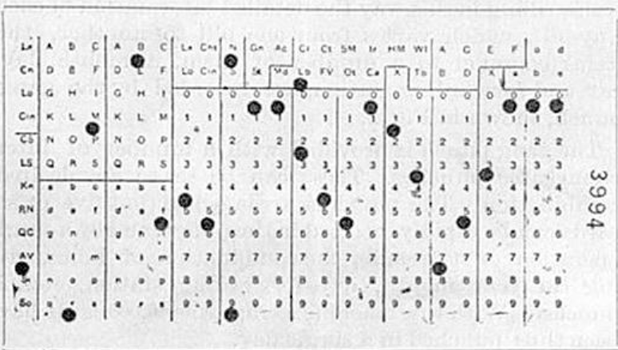

后来，由于社会发展，利用机器来代替人类手工来提升效率的需求增加，Herman Hollerith成立了制表机器公司。这家公司后来与其他机械公司合并，成为了 **国际商业机器公司，简称IBM** 。

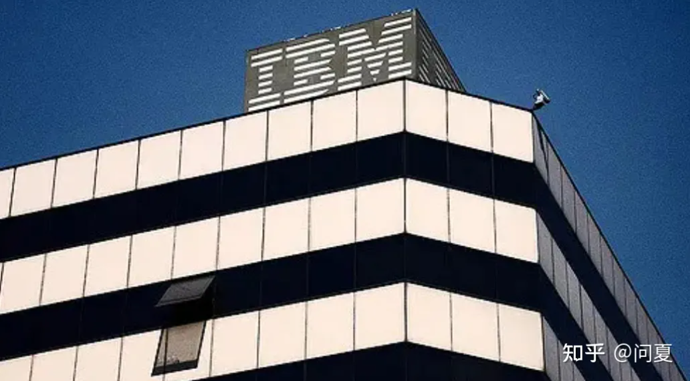

发展至今，IBM已经是百年企业，其在商业软硬件服务领域有着巨大的地位，18年世界500强企业位于第28位。

这些电子机械的“商业机器”取得巨大成功，改变了商业和政府。随着人口爆炸和经济贸易的兴起，要求更快更灵活的工具来处理数据，这就来到了—— **电子计算机时代** 。

  

    制表機
  

  - 制表机的工作是围绕穿孔卡片展开的：操作员先使用穿孔机制作穿孔卡片，再使用读卡装置识别卡片上的信息，机器自动完成统计并在示数表盘上实时显示结果，最后，将卡片投入分类箱的某一格中，进行分类存放，以供下次统计使用。

  - 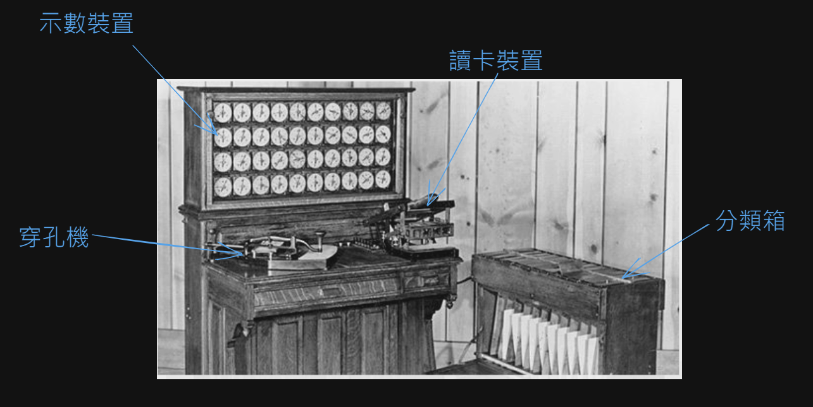

---
 

# 計算設備的發展歷程

  

    步進計算器
  

  - 1694年，德国博学家，Gottfried Leibniz 建造。这个机器有点像汽车里的里程表，不断累加里程数，是第一台能做 **加减乘除** 全部四种运算的机器，它的设计非常成功，以至于沿用了 3 个世纪。
  
  - "步进计算器"有点像汽车里的里程表，不断累加里程数，它有一连串可以转动的齿轮，每个齿轮有十个齿，代表数字 0 到 9，每当一个齿轮转过 9，它会转回 0，同时让旁边的齿轮前进 1 个齿，就像算盘超过 10 一样。做减法时，机器会反向运作，利用一些巧妙的机械结构，步进计算器也能做乘法和除法，乘法和除法实际上只是多个加法和减法，举例，17 除以 5，我们只要减5，减5，再减 5，直到不能再减 5，就知道了 $17=5*3+2$ 。

  - 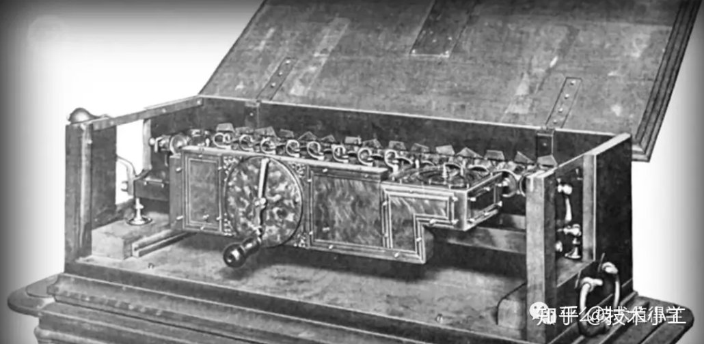
  
  - 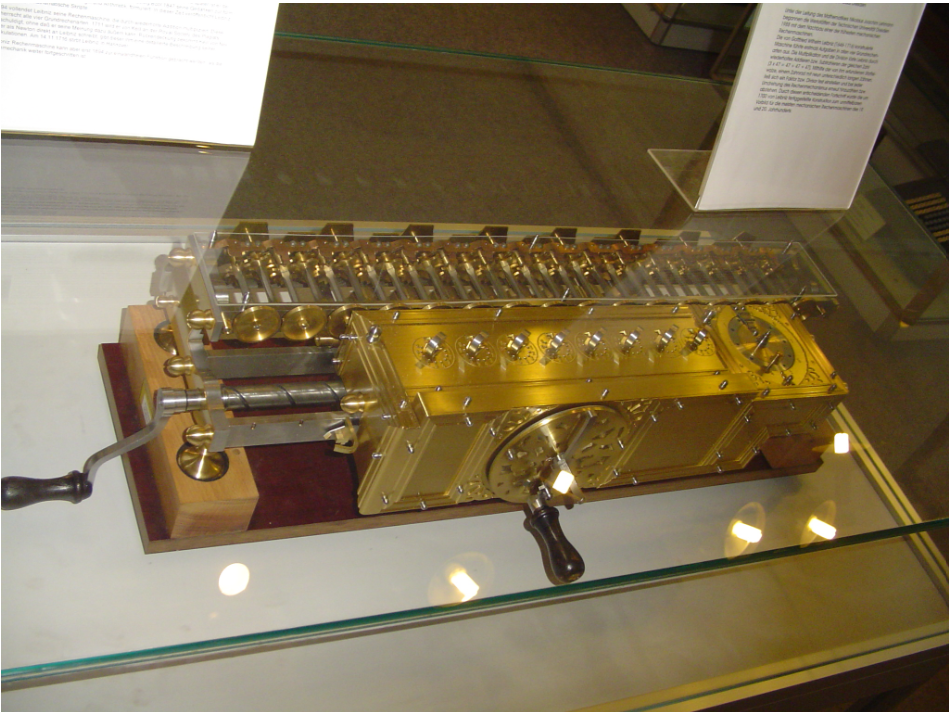
 
  - 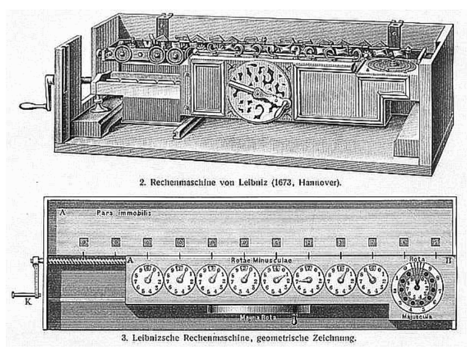
  
  - 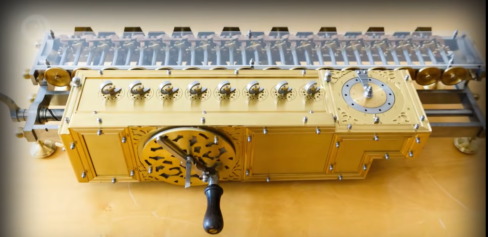

---
 

  

    計算表
  

  - 不幸的是，即使有机械计算器，大多数实际问题都需要经过多步计算才能得出答案，算一个结果可能要几小时甚至几天，而且这些手工制作的机器非常昂贵，大部分人买不起，所以在 20 世纪以前，大部分人会用预先算好的计算表，这些计算表由之前说的 **人力计算器** 编撰。

  - 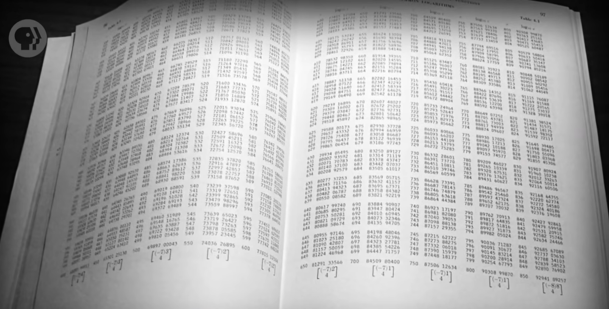

  - 如果你想知道 867,5309 的平方根，与其花一整天来手摇 "步进计算器”，你可以花一分钟在表里找答案，速度和准确性在战场上尤为重要，因此军队很早就开始用计算解决复杂问题，如何精确瞄准炮弹是一个很难的问题，19 世纪，这些炮弹的射程可以达到 1 公里以上。因为风力，温度，大气压力会不断变化，想打中船一样大的物体也非常困难，于是出现了射程表，炮手可以查环境条件和射击距，然后这张表会告诉他们，角度要设成多少，这些射程表很管用，二战中被广泛应用。问题是如果改了大炮或炮弹的设计，就要算一张新表，这样很耗时而且会出错。

  - 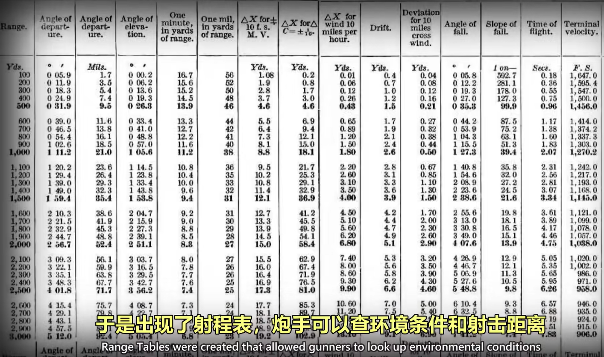

---
 

  

    差分機
  

  - Charles Babbage 在 1822 年写了一篇论文，向皇家天文学会指出了这个问题，标题叫： "机械在天文与计算表中的应用”，Charles Babbage 提出了一种新型机械装置叫 "差分机”，一个更复杂的机器，能近似多项式，多项式描述了几个变量之间的关系，比如射程和大气压力，多项式也可以用于近似对数和三角函数，这些函数手算相当麻烦，Charles Babbage 在 1823 年开始建造差分机，并在接下来二十年，试图制造和组装 25,000 个零件，总重接近 15 吨，不幸的是，该项目最终放弃了。

  - 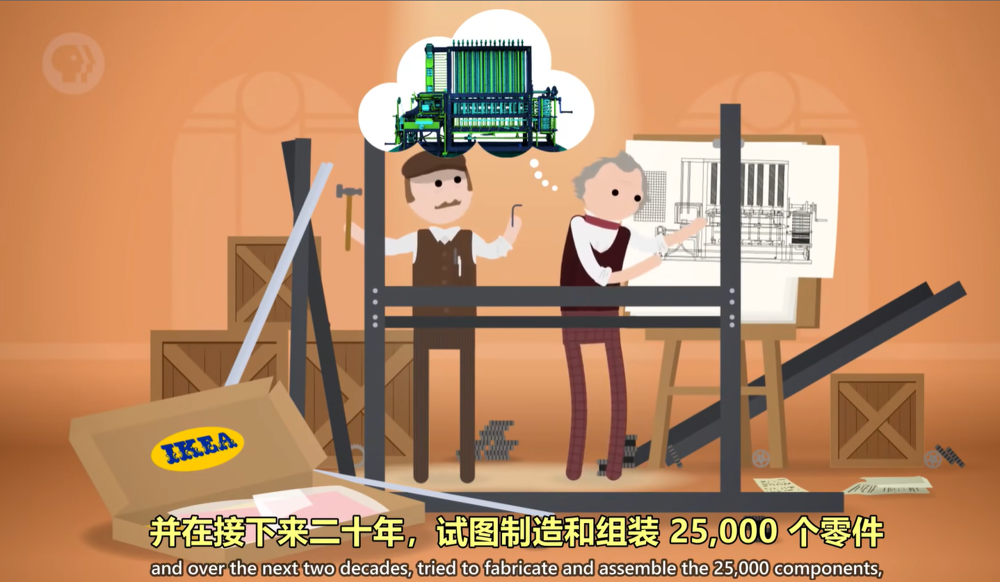

  - 但在 1991 年，历史学家根据 Charles Babbage 的草稿做了一个差分机，而且它还管用！

  - 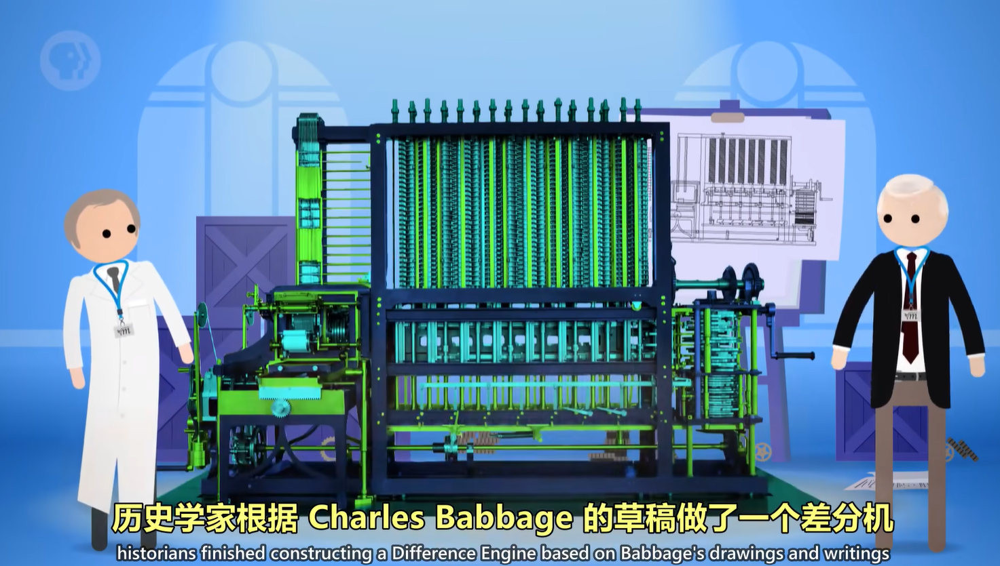

---
 

  

    分析機
  

  - 在差分机的建造期间，Charles Babbage 构想了一个更复杂的机器 - 分析机，不像差分机、步进计算器、以前的其他计算设备，分析机是 "通用计算机”，它可以做很多事情，不只是一种特定运算，甚至可以给它数据，然后按顺序执行一系列操作，它有内存，甚至還有一台很原始的打印机。
  
  - 就像差分机，这台机器太超前了，所以没有建成，然而，这种 "自动计算机" 的概念  ⇒  计算机可以自动完成一系列操作，是个跨时代的概念，预示着计算机程序的诞生，英国数学家 Ada Lovelace 给分析机写了假想的程序，她说："未来会诞生一门全新的，强大的，专为分析所用的语言”，因此 Ada 被认为是世上第一位程序员。分析机激励了第一代计算机科学家，这些计算机科学家把很多 Charles Babbage 的点子融入到他们的机器，所以 Charles Babbage 经常被认为是 **计算之父** 。

  - 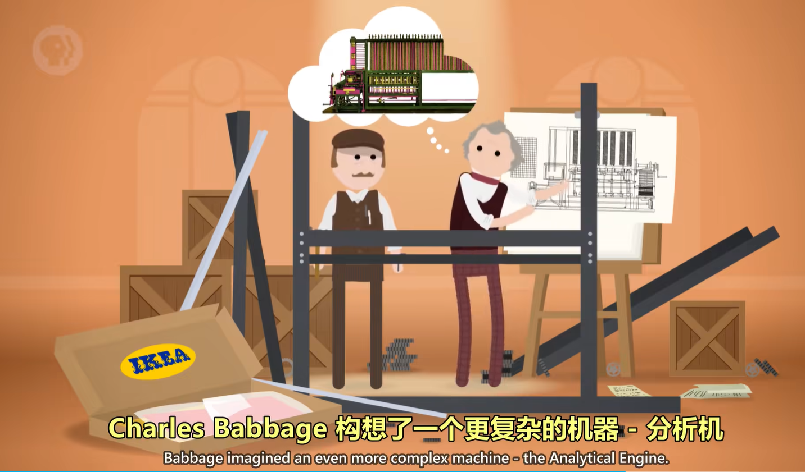

---
 

# 參考資料
  - [公开分享版本【计算机科学速成课】 笔记](https://shimo.im/docs/PJAUY30F1uYksv0h/read "公开分享版本【计算机科学速成课】 笔记")
  - [《计算机科学》— 1 计算机早期历史](https://zhuanlan.zhihu.com/p/396286080 "《计算机科学》— 1 计算机早期历史")
  - [计算机速成课：第一集 计算机早期历史 ](https://www.cnblogs.com/zxxsteven/p/14827664.html "计算机速成课：第一集 计算机早期历史 ")