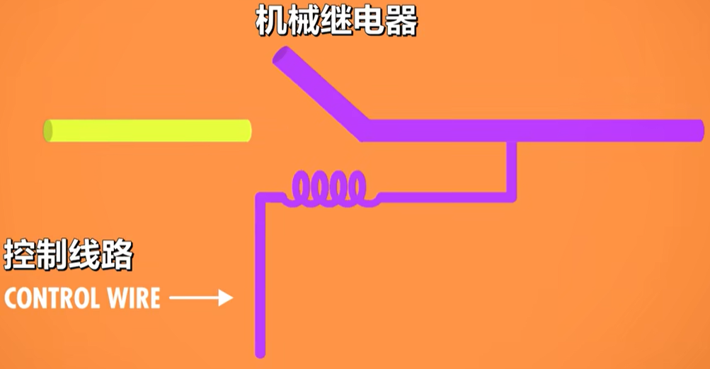
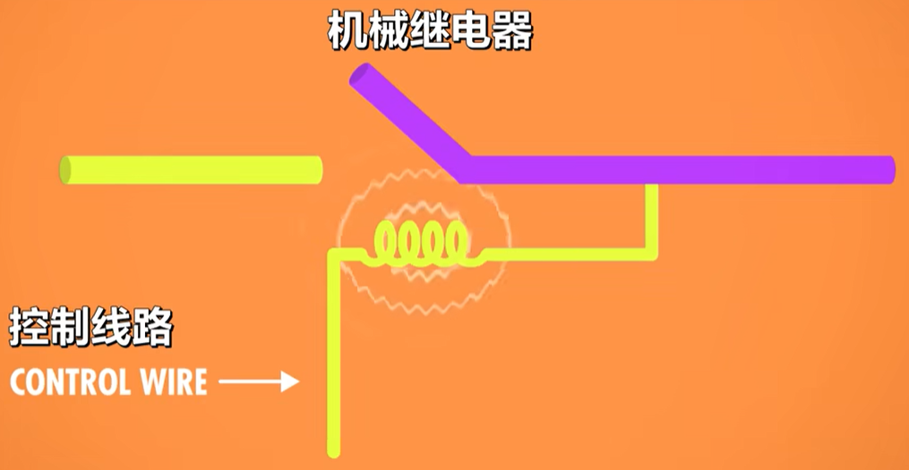
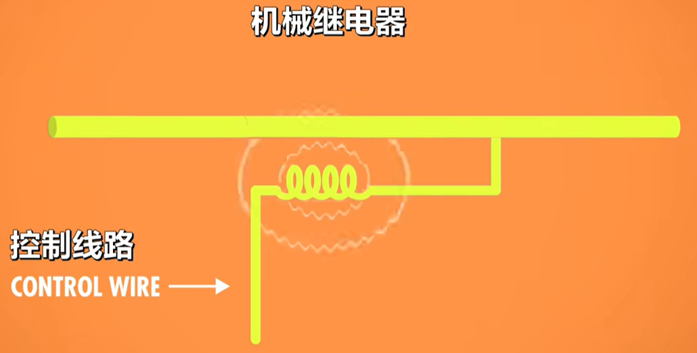
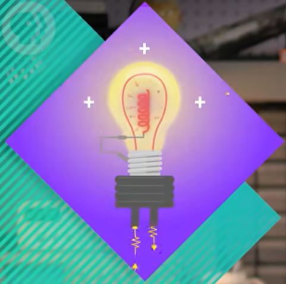
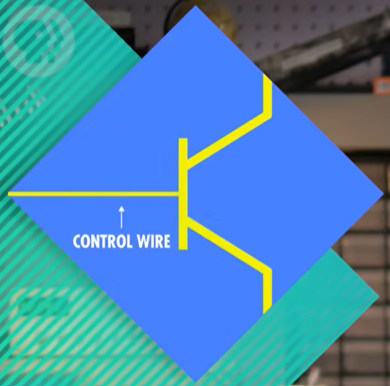
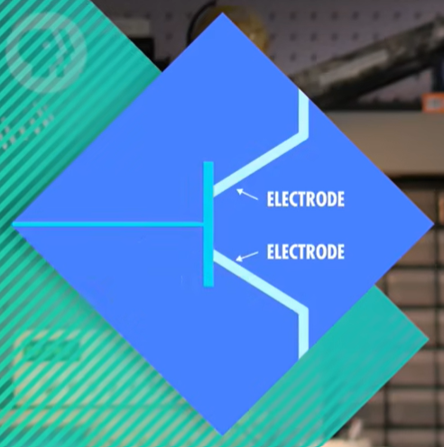
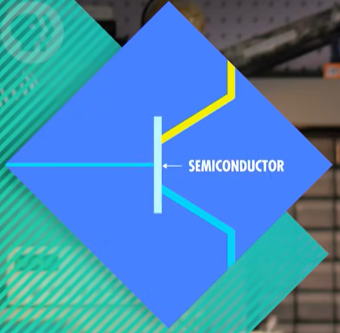
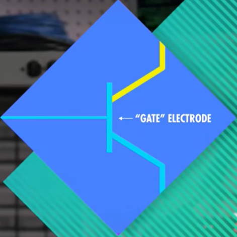
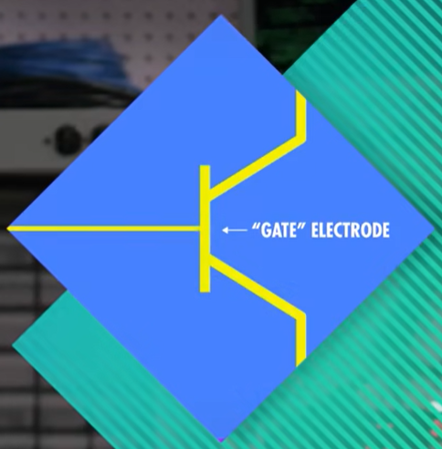

* [電子計算機元器件變化](#電子計算機元器件變化)
* [電子計算機的發展](#電子計算機的發展)
* [繼電器](#繼電器)
* [真空管](#真空管)
* [晶體管](#晶體管)
* [參考資料](#參考資料)

---

# 電子計算機元器件變化

- 继电器 → 真空管 → 晶体管

# 電子計算機的發展

- 1945 年 哈佛马克 1：使用继电器，用电磁效应，控制机械开关，缺点为有磨损和延迟。
  - 最早还因为有虫子飞进去导致故障，引申出 bug=故障的意思。

- 1943 年 巨人 1 号：使用真空管（三极管），制造出世界上第一个可编程的计算机。

- 1946 年 ENIAC：第一个电子通用数值积分计算机。

- 1947 年 晶体管出现，使用的是固态的半导体材料，相对真空管更可靠。

- 1950s 空军 ANFSQ-7： 真空管到达计算极限。

- 1957 年 IBM 608： 第一个消费者可购买的晶体管计算机出现。

# 繼電器

- 哈弗克一号是IBM公司为模曼哈顿计研制的机电计算机，由大约3500个继电器构成。哈佛马克一号1秒能做3次加减法运算，一次乘法需要6秒，除法需要15秒，三角函数需要一分钟以上。

- 继电器:用电控制的机械开关。继电器里有根 **控制线路** ，控制电路是开还是关， **控制线路** 连着一个线圈，当电流流过线圈，线圈产生电磁场，吸引金属臂，从而闭合电路。

- **性能 :** 1940年一个好的继电器1秒能翻转50次。

- **缺点 :** 
  - 控制开关的金属臂是 **有重量的** ，所以一定时间内开关次数受限，并且金属臂的反复移动就会存在磨损(任何会动的机械都会随时间磨损)。
  - 哈佛马克一号有大约3500个继电器，假设继电器的使用寿命是10年，意味着平均每天要换一个故障的继电器。

- 继电器是：用电控制的机械开关，继电器里有根 "控制线路"，控制电路是开还是关。
  - 

- "控制线路" 连着一个线圈，当电流流过线圈，线圈产生电磁场，吸引金属臂，从而闭合电路。
  - 
  - 

# 真空管

- **热电子管 :** 在1904年，英国物理学家约翰·安布罗斯·弗莱明开发了一种新的电子组件，叫 **热电子管（thermionic valve）** ，把两个电极装在一个气密的玻璃灯泡里，这是世界上第一个真空管。
  - 其中一个电极可以加热，从而发射电子，这叫做 **热电子发射（thermionic emission）** 。另一个电极会吸引电子，形成电流，但只有带正电才行，如果带负电荷或中性电荷，电子没办法被吸引，越过真空区域，因此没有电流。
  - 
  - 
  - 
  - 

- 电流只能单向流动的电子部件叫做 **二极管（diode）** ，我们需要一个能开关电流的东西，Luckily，在1906年，美国发明家李·德富雷斯特在“弗莱明”设计的两个电极之间加入了第三个 **控制电极** 。
  - 向 **控制电极** 施加正电荷，它会允许电子流动，但如果施加负电荷，它会阻止电子流动。因此通过控制线路可以断开或闭合电路，和继电器的功能一样。Importantly，真空管内没有会动的组件，意味着更少的磨损，more importantly，每秒可以开闭数千次。
  - 
  - 
  - 

- **性能 :** 1秒可开闭数千次。真空管内没有会动的组件，因此存在更少的磨损。

- **缺点 :** 会像灯泡一样烧坏，且体积大。

- **巨人一號**
  - 第一个大规模使用真空管的计算机是 "巨人1号”，由工程师 Tommy Flowers 设计，完工于 1943 年12 月，巨人 1 号 在英国的"布莱切利园"，用于破解纳粹通信。
  - 听起来可能有点熟，因为在 2 年前，被称为计算机科学之父的艾伦-图灵也在"布莱切利园"做了台机电装置，叫 "Bombe”，这台机器的设计目的是 破解纳粹"英格码"通讯加密设备，但 Bombe 严格来说不算计算机。
  - 总之，巨人1号有 1600 个真空管，总共造了 10 台巨人计算机，来帮助破解密码。巨人 被认为是第一个可编程的电子计算机，编程的方法是把几百根电线插入插板，有点像老电话交换机，这是为了让计算机执行正确操作，虽然"可编程" ，但还是要配置它。

- **电子数值积分计算机**
  - 电子数值积分计算机 "ENIAC”，几年后在 1946 年，在"宾夕法尼亚大学"完成建造，设计者是 John Mauchly 和 J. Presper Eckert，这是世上第一个真正的通用，可编程，电子计算机，ENIAC 每秒可执行 5000 次十位数加减法，比前辈快了很多倍，它运作了十年，据估计，它完成的运算，比全人类加起来还多，因为真空管很多，所以故障很常见，ENIAC 运行半天左右就会出一次故障。

# 晶體管

- **晶体管 :** 晶体管是一个用于控制电路闭合断开的开关。晶体管有两个电极，这两个电极之间通过半导体材料隔开。这里通过控制線连接到半导体的电极电荷数，可以控制半导体的导电性，由此来控制电流是否流动。 当控制线路通电时两个电极接通，否则两个电极断开。
  - 

- **性能 :** 每秒可开关10000次。晶体管是固体的，体积远小继电器和真空管。

- 晶体管有两个电极，电极之间有一种材料隔开它们，这种材料有时候导电、有时候不导电，这叫 "半导体”。
  - 
  - 

- 控制线连到一个 "门" ，通过改变 "门" 的电荷，我们可以控制半导体材料的导电性，来允许或不允许电流流动。
  - 
  - 

> 第一个消费者可购买的，完全由晶体管构成的计算机是1957年发布的BM608， 它有3000个晶体管，每秒执行4500次加减法，或80次左右的乘除法。

> 如今，计算机里的晶体管小于50nm，并且每秒可切换上百万次，工作几十年。很多晶体管和半导体开发在圣克拉拉谷，位于旧金山和圣河西之间，由于制造半导体最常见的材料是，由此这个地方被称为“硅谷”。并旦WilliamShockley搬过去创建了肖克利半导体，里面的员工后来成立了仙童半导体，而这里面的员工后来创立了英特尔。

# 參考資料
  - [《计算机科学速成课》——（2）电子计算机](https://blog.csdn.net/weixin_43220677/article/details/122600429 "《计算机科学速成课》——（2）电子计算机")
  - [计算机科学速成课 Crash Course Computer Science 第二集 电子计算机 Electronic Computing](https://blog.csdn.net/qq_43413123/article/details/104222260 "计算机科学速成课 Crash Course Computer Science 第二集 电子计算机 Electronic Computing")
  - [公开分享版本【计算机科学速成课】 笔记](https://shimo.im/docs/PJAUY30F1uYksv0h/read "公开分享版本【计算机科学速成课】 笔记")